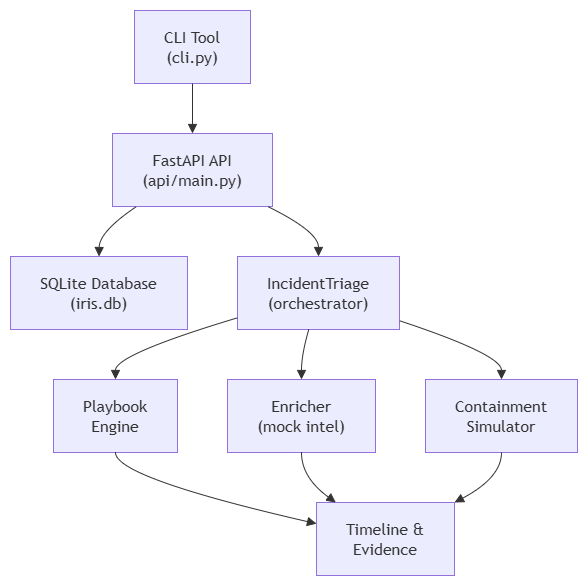

# IRIS — Incident Response Playbook Automation Engine

IRIS is a **SOAR-like incident response automation engine** that takes a security incident ticket (JSON), executes a step-by-step IR playbook, enriches data with mock threat intel, simulates containment actions, and produces a unified timeline and evidence package.

This project demonstrates a complete backend service with a REST API, CLI tool, database persistence, and automated testing — ideal for showcasing skills in **security automation**, **backend engineering**, and **incident response**.

---

## 📖 Table of Contents

- [Features](#features)
- [Architecture](#architecture)
- [Tech Stack](#tech-stack)
- [Project Structure](#project-structure)
- [Getting Started](#getting-started)
  - [Prerequisites](#prerequisites)
  - [Installation](#installation)
- [Usage](#usage)
  - [FastAPI Backend](#fastapi-backend)
  - [CLI Tool](#cli-tool)
- [API Endpoints](#api-endpoints)
- [Playbooks](#playbooks)
- [Testing](#testing)
- [Screenshots](#screenshots)
- [Contributing](#contributing)
- [License](#license)

---

## ✨ Features

- **Playbook-Driven Automation** – YAML-defined playbooks executed step-by-step.
- **Incident Schema** – Standardized JSON representation of security incidents.
- **Threat Intel Enrichment** (mocked) – VirusTotal hash lookup, IP reputation, URL analysis, GeoIP.
- **Containment Simulation** – Isolate host, disable user, block IP, kill process, snapshot VM, quarantine file.
- **Evidence Collection** – All artifacts stored and linked to incidents.
- **Timeline Reconstruction** – Merged view of raw logs, playbook actions, and evidence.
- **REST API** – FastAPI with async background processing.
- **CLI Tool** – Terminal interface for operators.
- **SQLite Database** – Persistent storage with SQLAlchemy ORM.
- **Comprehensive Tests** – 24+ tests covering all modules.

---

## 🏗 Architecture

---

---